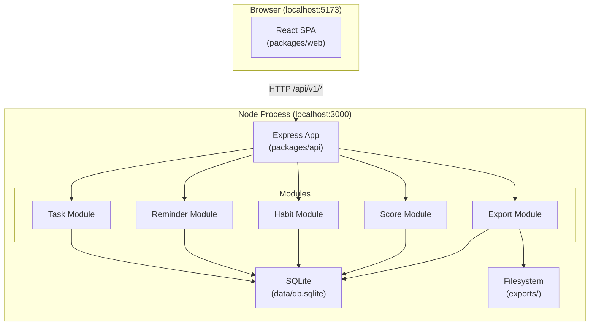

# DailyFlow — Technical Design Document

## Overview

DailyFlow is a single-user personal productivity hub implemented as a TypeScript monorepo with:

- **`packages/api`** — Express REST API backed by a local SQLite database (`data/db.sqlite`).
- **`packages/web`** — React + Vite single-page application served on `localhost:5173`.

The application is composed of six functional modules that together cover the complete feature set:

| Module | Responsibility |
|---|---|
| Shared User Identity | One canonical `users` row; all other entities reference it via `userId` foreign key |
| Task Board | Kanban CRUD — three status columns, `completedAt` lifecycle |
| Reminder Engine | Time-based CRUD, recurrence (none / daily / weekly), acknowledge + snooze |
| Habit Tracker | Daily completion logging, consecutive-streak computation, 365-day heatmap data |
| Score Engine | Real-time weighted Productivity Score derived from the three data modules |
| Export Service | Full data snapshot serialised to a timestamped JSON file in `exports/` |

The API enforces the response envelope `{ data: T | null, error: string | null }` on every route. All routes are mounted under `/api/v1`.

---

## Architecture

### High-Level Diagram



### Request / Response Flow

```
Browser → fetch('/api/v1/…')
         → Express Router
         → Validator middleware (400 on bad input)
         → Service layer (business logic, SQLite queries)
         → { data, error } envelope
         → Browser
```

### Layer Responsibilities

| Layer | Location | Role |
|---|---|---|
| Router | `src/modules/<name>/router.ts` | Parse HTTP, delegate to service |
| Validator | `src/modules/<name>/validator.ts` | Zod schema checks, return 400 on failure |
| Service | `src/modules/<name>/service.ts` | Business logic, DB access via `db.ts` |
| Types | `src/types/shared.ts` + per-module `types.ts` | Shared interfaces, no runtime code |
| DB init | `src/db.ts` | Schema migration run at startup |

---

## Components and Interfaces

### Backend — Module Breakdown

#### Shared User Module (`src/modules/user/`)

| File | Purpose |
|---|---|
| `router.ts` | `GET /api/v1/user` — return the single user record |
| `service.ts` | `getUser()`, `upsertUser()` |

The application seeds a default user on first startup if the `users` table is empty.

#### Task Module (`src/modules/tasks/`)

| File | Purpose |
|---|---|
| `router.ts` | `POST /tasks`, `GET /tasks`, `PATCH /tasks/:id`, `DELETE /tasks/:id` |
| `validator.ts` | Zod schemas for create / update payloads |
| `service.ts` | `createTask()`, `listTasks()`, `updateTask()`, `deleteTask()` |
| `types.ts` | `Task`, `CreateTaskDto`, `UpdateTaskDto` |

Key business rules in service:
- Default `status = 'todo'` when omitted.
- Set `completedAt = NOW()` when status transitions to `done`; clear it otherwise.
- Do not send an update request when a card is dropped into its current column (enforced in UI).

#### Reminder Module (`src/modules/reminders/`)

| File | Purpose |
|---|---|
| `router.ts` | `POST /reminders`, `GET /reminders`, `PATCH /reminders/:id`, `DELETE /reminders/:id`, `POST /reminders/:id/acknowledge`, `POST /reminders/:id/snooze` |
| `validator.ts` | Zod schemas including ISO 8601 `scheduledAt`, snooze range [1, 1440] |
| `service.ts` | CRUD + `acknowledgeReminder()`, `snoozeReminder()` |
| `types.ts` | `Reminder`, `CreateReminderDto`, `UpdateReminderDto`, `SnoozeDto` |

Recurrence logic (inside `acknowledgeReminder`):
- `daily` → create new reminder with `scheduledAt + 24 h`, `acknowledged = false`.
- `weekly` → create new reminder with `scheduledAt + 7 d`, `acknowledged = false`.
- Both operations are wrapped in a SQLite transaction; failure rolls back acknowledgement.

#### Habit Module (`src/modules/habits/`)

| File | Purpose |
|---|---|
| `router.ts` | `POST /habits`, `GET /habits`, `PATCH /habits/:id`, `DELETE /habits/:id`, `POST /habits/:id/completions`, `GET /habits/:id/streak`, `GET /habits/:id/heatmap` |
| `validator.ts` | Zod schemas; name ≤ 100 chars, description ≤ 500 chars |
| `service.ts` | CRUD + `logCompletion()`, `computeStreak()`, `getHeatmapData()` |
| `streakUtils.ts` | Pure streak calculation (UTC-offset-aware, already present with known Phase-6 bug) |
| `types.ts` | `Habit`, `HabitCompletion`, `HeatmapDay` |

Streak computation (corrected algorithm):
- Accept `utcOffset` minutes from request query param.
- Convert each `completedAt` to a local calendar date string using the offset before deduplication.
- Walk backward from today (local date) counting consecutive days with at least one completion.

#### Score Module (`src/modules/score/`)

| File | Purpose |
|---|---|
| `router.ts` | `GET /score` |
| `service.ts` | `computeScore()` — pure function reading DB state |

Formula (from product rules):
```
score = clamp(round2dp(
  (task_completion_rate  × 0.4)
+ (reminder_ack_rate    × 0.3)
+ (habit_streak_consistency × 0.3)
) × 100, 0, 100)
```

Where:
- `task_completion_rate` = `done_tasks / total_tasks` (0 when no tasks).
- `reminder_ack_rate` = `acknowledged_today / total_due_today` (0 when none due today).
- `habit_streak_consistency` = `mean(current_streak / max_possible_streak)` across all active habits (0 when none active; per-habit ratio = 0 when `max_possible_streak = 0`).
- `max_possible_streak` = calendar days since `habit.createdAt` (inclusive).

#### Export Module (`src/modules/export/`)

| File | Purpose |
|---|---|
| `router.ts` | `POST /export` — already scaffolded, to be implemented via MCP filesystem tool |
| `service.ts` | `buildExportPayload()` (pure assembly), `writeExportFile()` (MCP filesystem write) |

Export payload shape:
```typescript
interface ExportPayload {
  exportedAt: string;       // ISO 8601 UTC
  user: User;
  tasks: Task[];
  reminders: Reminder[];
  habits: Habit[];
  completions: HabitCompletion[];
  score: {
    value: number;
    task_completion_rate: number;
    reminder_ack_rate: number;
    habit_streak_consistency: number;
  };
}
```

Filename format: `dailyflow-export-YYYY-MM-DDTHH-mm-ss[Z].json` (UTC, colons replaced with hyphens for filesystem safety).

All dates serialised as ISO 8601 UTC strings (`toISOString()`).

---

### Frontend — Component Breakdown

```
src/
  App.tsx                       ← tab navigation, global error/loading context
  features/
    tasks/
      components/
        TaskBoard.tsx           ← Kanban board container
        TaskColumn.tsx          ← One status column (todo / in_progress / done)
        TaskCard.tsx            ← Draggable card; dispatches update on drop
        TaskForm.tsx            ← Create / edit form modal
    reminders/
      components/
        ReminderList.tsx        ← Day-scoped list with due/overdue indicators
        ReminderForm.tsx        ← Create / edit form modal
        ReminderItem.tsx        ← Row with Acknowledge and Snooze actions
    habits/
      components/
        HabitList.tsx           ← List of habits with streak badge
        HabitForm.tsx           ← Create / edit form modal
        HabitHeatmap.tsx        ← 7×53 grid with 4-level colour scale
    score/
      components/
        ScoreDisplay.tsx        ← Gauge / number card; auto-refreshes on mutations
    export/
      components/
        ExportButton.tsx        ← Trigger export, show file path on success
  shared/
    components/
      LoadingSpinner.tsx        ← Shown within 100 ms of request start
      ErrorNotification.tsx     ← Toast; visible ≥ 3 s
    hooks/
      useApi.ts                 ← Fetch wrapper: manages loading/error state
      useScore.ts               ← Subscribes to mutations; re-fetches score
    api/
      client.ts                 ← Base fetch with envelope unwrapping
      tasks.ts                  ← Task API calls
      reminders.ts              ← Reminder API calls
      habits.ts                 ← Habit API calls
      score.ts                  ← Score API call
      export.ts                 ← Export API call
```

### State Management

The frontend uses **React's built-in `useState` / `useReducer` + custom hooks** — no external state library is introduced.

- Each feature module owns its local state (list of items, loading flag, error string).
- `useApi<T>(fn)` — wraps an API call, returns `{ data, loading, error, execute }`. Sets `loading = true` within 0 ms of `execute()` being called so the loading indicator appears within the required 100 ms.
- `useScore` — exposes a `refresh()` function called by task/reminder/habit mutation hooks after a successful write, with a 2-second debounce guard to satisfy the "within 2 seconds" requirement.
- Drag-and-drop in `TaskBoard` is implemented with the native HTML5 Drag and Drop API (no additional library required) using `onDragStart` / `onDragOver` / `onDrop` events on cards and columns. No update request is dispatched if the drop target column equals the card's current status.
- Reminders due today are polled on `ReminderList` mount and filtered client-side by comparing `scheduledAt` to `[00:00:00, 23:59:59]` in the local timezone.

---

## Data Models

### SQLite Schema

```sql
-- ── Users ──────────────────────────────────────────────────────────────────
CREATE TABLE IF NOT EXISTS users (
  id         TEXT PRIMARY KEY,              -- UUID v4
  email      TEXT UNIQUE NOT NULL,          -- local-part@domain
  name       TEXT NOT NULL,
  created_at TEXT NOT NULL DEFAULT (datetime('now'))
);

-- ── Tasks ───────────────────────────────────────────────────────────────────
CREATE TABLE IF NOT EXISTS tasks (
  id           TEXT PRIMARY KEY,
  user_id      TEXT NOT NULL REFERENCES users(id) ON DELETE CASCADE,
  title        TEXT NOT NULL,
  status       TEXT NOT NULL DEFAULT 'todo'  CHECK(status IN ('todo','in_progress','done')),
  priority     TEXT NOT NULL                 CHECK(priority IN ('low','medium','high')),
  category     TEXT NOT NULL                 CHECK(category IN ('work','personal','health')),
  due_date     TEXT,                         -- ISO 8601 date string, nullable
  completed_at TEXT,                         -- ISO 8601 datetime, set when status→'done'
  created_at   TEXT NOT NULL DEFAULT (datetime('now'))
);

-- ── Reminders ───────────────────────────────────────────────────────────────
CREATE TABLE IF NOT EXISTS reminders (
  id              TEXT PRIMARY KEY,
  user_id         TEXT NOT NULL REFERENCES users(id) ON DELETE CASCADE,
  title           TEXT NOT NULL,             -- 1–200 characters
  scheduled_at    TEXT NOT NULL,             -- ISO 8601 datetime
  category        TEXT NOT NULL             CHECK(category IN ('work','personal','health')),
  recurrence      TEXT NOT NULL DEFAULT 'none' CHECK(recurrence IN ('none','daily','weekly')),
  acknowledged    INTEGER NOT NULL DEFAULT 0, -- 0 = false, 1 = true
  acknowledged_at TEXT,                      -- ISO 8601 datetime, nullable
  created_at      TEXT NOT NULL DEFAULT (datetime('now'))
);

-- ── Habits ──────────────────────────────────────────────────────────────────
CREATE TABLE IF NOT EXISTS habits (
  id          TEXT PRIMARY KEY,
  user_id     TEXT NOT NULL REFERENCES users(id) ON DELETE CASCADE,
  name        TEXT NOT NULL,                 -- 1–100 characters
  description TEXT,                          -- up to 500 characters, nullable
  active      INTEGER NOT NULL DEFAULT 1,    -- 0 = false, 1 = true
  created_at  TEXT NOT NULL DEFAULT (datetime('now'))
);

-- ── Habit Completions ────────────────────────────────────────────────────────
CREATE TABLE IF NOT EXISTS habit_completions (
  id           TEXT PRIMARY KEY,
  habit_id     TEXT NOT NULL REFERENCES habits(id) ON DELETE CASCADE,
  user_id      TEXT NOT NULL REFERENCES users(id) ON DELETE CASCADE,
  completed_at TEXT NOT NULL,                -- ISO 8601 datetime
  -- Uniqueness enforced per habit per calendar day in service layer (UTC-offset-aware)
  UNIQUE(habit_id, date(completed_at))       -- SQLite date() normalises to UTC date
);
```

**Indexes** (added after schema creation for query performance):

```sql
CREATE INDEX IF NOT EXISTS idx_tasks_user_id       ON tasks(user_id, created_at DESC);
CREATE INDEX IF NOT EXISTS idx_reminders_user_id   ON reminders(user_id, scheduled_at ASC);
CREATE INDEX IF NOT EXISTS idx_habits_user_id      ON habits(user_id);
CREATE INDEX IF NOT EXISTS idx_completions_habit   ON habit_completions(habit_id, completed_at DESC);
```

### TypeScript Interfaces (API layer)

```typescript
// src/modules/tasks/types.ts
export type TaskStatus   = 'todo' | 'in_progress' | 'done';
export type TaskPriority = 'low' | 'medium' | 'high';
export type TaskCategory = 'work' | 'personal' | 'health';

export interface Task {
  id: string;
  userId: string;
  title: string;
  status: TaskStatus;
  priority: TaskPriority;
  category: TaskCategory;
  dueDate: string | null;
  completedAt: string | null;
  createdAt: string;
}

export interface CreateTaskDto {
  userId: string;
  title: string;
  priority: TaskPriority;
  category: TaskCategory;
  status?: TaskStatus;    // defaults to 'todo'
  dueDate?: string;
}

export interface UpdateTaskDto {
  title?: string;
  status?: TaskStatus;
  priority?: TaskPriority;
  category?: TaskCategory;
  dueDate?: string | null;
}

// src/modules/reminders/types.ts
export type ReminderRecurrence = 'none' | 'daily' | 'weekly';
export type ReminderCategory   = 'work' | 'personal' | 'health';

export interface Reminder {
  id: string;
  userId: string;
  title: string;
  scheduledAt: string;
  category: ReminderCategory;
  recurrence: ReminderRecurrence;
  acknowledged: boolean;
  acknowledgedAt: string | null;
  createdAt: string;
}

export interface SnoozeDto {
  minutes: number;   // [1, 1440]
}

// src/modules/habits/types.ts
export interface Habit {
  id: string;
  userId: string;
  name: string;
  description: string | null;
  active: boolean;
  createdAt: string;
}

export interface HabitCompletion {
  id: string;
  habitId: string;
  userId: string;
  completedAt: string;
}

export interface HeatmapDay {
  date: string;    // YYYY-MM-DD
  count: number;   // completions on that day (0 included)
}
```

### API Route Table

| Method | Path | Description | Success Code |
|---|---|---|---|
| `GET` | `/api/v1/health` | Health check | 200 |
| `GET` | `/api/v1/user` | Get the single user record | 200 |
| `POST` | `/api/v1/tasks` | Create a task | 201 |
| `GET` | `/api/v1/tasks` | List all tasks (ordered by `createdAt` desc) | 200 |
| `PATCH` | `/api/v1/tasks/:id` | Update a task | 200 |
| `DELETE` | `/api/v1/tasks/:id` | Delete a task | 200 |
| `POST` | `/api/v1/reminders` | Create a reminder | 201 |
| `GET` | `/api/v1/reminders` | List all reminders (ordered by `scheduledAt` asc) | 200 |
| `PATCH` | `/api/v1/reminders/:id` | Update a reminder | 200 |
| `DELETE` | `/api/v1/reminders/:id` | Delete a reminder | 200 |
| `POST` | `/api/v1/reminders/:id/acknowledge` | Acknowledge a reminder; creates recurrence if applicable | 200 |
| `POST` | `/api/v1/reminders/:id/snooze` | Snooze a reminder by `minutes` | 200 |
| `POST` | `/api/v1/habits` | Create a habit | 201 |
| `GET` | `/api/v1/habits` | List all habits | 200 |
| `PATCH` | `/api/v1/habits/:id` | Update a habit | 200 |
| `DELETE` | `/api/v1/habits/:id` | Delete a habit and its completions | 200 |
| `POST` | `/api/v1/habits/:id/completions` | Log a completion for today | 201 |
| `GET` | `/api/v1/habits/:id/streak` | Get current streak (requires `?utcOffset` query param, minutes) | 200 |
| `GET` | `/api/v1/habits/:id/heatmap` | Get 365-day date-count pairs | 200 |
| `GET` | `/api/v1/score` | Compute and return the current Productivity Score | 200 |
| `POST` | `/api/v1/export` | Serialize all data to a timestamped JSON file in `exports/` | 200 |


---

## Correctness Properties

*A property is a characteristic or behavior that should hold true across all valid executions of a system — essentially, a formal statement about what the system should do. Properties serve as the bridge between human-readable specifications and machine-verifiable correctness guarantees.*

**Property Reflection (pre-write analysis)**

Before writing, redundancies were resolved:
- Requirements 9.5 (clamp/round) is subsumed by Property 1 (score formula), which already exercises the full pipeline.
- Requirements 7.5 (streak ending on today/yesterday) is subsumed by Property 4 (streak consecutive-day computation).
- Requirements 3.1 and 3.2 (`completedAt` set/cleared) are combined into one round-trip property (Property 7).
- Requirements 5.6 and 5.7 (daily vs weekly recurrence scheduling) are consolidated into one recurrence property (Property 8).

---

### Property 1: Score formula weighted sum

*For any* triple of rates `(t, r, h)` each in [0, 1], the Productivity Score returned by the Score Engine SHALL equal `round2dp(clamp((t × 0.4 + r × 0.3 + h × 0.3) × 100, 0, 100))`.

**Validates: Requirements 9.1, 9.5**

---

### Property 2: Task completion rate ratio

*For any* non-empty list of tasks with arbitrary status values, `task_completion_rate` SHALL equal `count(status = 'done') / total`, and SHALL be `0` when the list is empty.

**Validates: Requirements 9.2**

---

### Property 3: Reminder acknowledgement rate ratio

*For any* set of reminders, `reminder_ack_rate` SHALL equal `count(acknowledged = true AND scheduledAt within today) / count(scheduledAt within today)`, and SHALL be `0` when no reminders are due today.

**Validates: Requirements 9.3**

---

### Property 4: Habit streak consistency mean

*For any* non-empty list of active habits each with a `(current_streak, max_possible_streak)` pair, `habit_streak_consistency` SHALL equal the arithmetic mean of `(current_streak / max_possible_streak)` per habit, where the per-habit ratio is `0` when `max_possible_streak = 0`, and SHALL be `0` when the list is empty.

**Validates: Requirements 9.4**

---

### Property 5: Streak consecutive-day computation

*For any* list of `completedAt` timestamps representing exactly N distinct consecutive calendar days ending on today or yesterday (resolved using the supplied UTC offset), the streak value returned by the Habit Tracker SHALL equal N. *For any* list where the most recent completion is two or more days before today, the streak SHALL be 0.

**Validates: Requirements 7.4, 7.5**

---

### Property 6: Heatmap 365-day coverage

*For any* set of habit completion records, the heatmap response SHALL contain exactly 365 entries, one per calendar day in the window `[today − 364, today]` (inclusive). Every entry SHALL have `count ≥ 0`, days with no completion records SHALL have `count = 0`, and the set of returned dates SHALL exactly equal the 365-day window with no duplicates.

**Validates: Requirements 8.1**

---

### Property 7: Task completedAt lifecycle round-trip

*For any* task with status ≠ `'done'`, updating its status to `'done'` SHALL set `completedAt` to a valid ISO 8601 UTC datetime. Subsequently updating the same task's status to any value other than `'done'` SHALL set `completedAt` to `null`.

**Validates: Requirements 3.1, 3.2**

---

### Property 8: Recurrence reminder scheduling offset

*For any* reminder with `recurrence = 'daily'` or `recurrence = 'weekly'`, acknowledging it SHALL produce a new reminder where: all fields are identical to the original except `scheduledAt` is advanced by exactly 24 hours (daily) or exactly 7 × 24 hours (weekly), and `acknowledged` is `false`.

**Validates: Requirements 5.6, 5.7**

---

### Property 9: Export date serialisation round-trip

*For any* valid `Date` value in the system, serialising it via the Export Service (using `toISOString()`) and then parsing the resulting string back with `new Date(str)` SHALL yield a `Date` whose `getTime()` equals the original `getTime()` — i.e., no precision loss or timezone shift occurs through the JSON export round-trip.

**Validates: Requirements 10.8**

---

### Property 10: Export payload structural completeness

*For any* system state (any combination of tasks, reminders, habits, and completions), the export payload returned by `buildExportPayload()` SHALL contain all of the following top-level keys with non-null values: `exportedAt`, `user`, `tasks`, `reminders`, `habits`, `completions`, `score`. The `score` object SHALL contain `value`, `task_completion_rate`, `reminder_ack_rate`, and `habit_streak_consistency`.

**Validates: Requirements 10.1**

---

### Property 11: Validator rejects invalid payloads with HTTP 400

*For any* request payload to a create or update endpoint where one required field is removed or set to a type-incompatible value, the Validator SHALL return HTTP 400 and the response body SHALL conform to `{ data: null, error: <non-empty string> }`.

**Validates: Requirements 11.4, 2.9, 2.10, 4.7, 4.8, 6.5**

---

## Error Handling

### Validation Errors (HTTP 400)

All route handlers delegate to a Zod-based validator before reaching the service layer. On any schema violation:

```json
{ "data": null, "error": "title is required" }
```

Specific cases:
- Missing required field → `"<fieldName> is required"`
- Invalid enum value → `"<fieldName> must be one of: <values>"`
- Invalid ISO 8601 datetime → `"scheduledAt must be a valid ISO 8601 datetime"`
- Snooze out of range → `"minutes must be between 1 and 1440"`
- Name too long → `"name must not exceed 100 characters"`

### Not Found (HTTP 404)

Any request referencing a `userId`, task `id`, reminder `id`, or habit `id` that does not exist:

```json
{ "data": null, "error": "Task not found" }
```

### Conflict Errors (HTTP 409)

- Duplicate habit completion for the same calendar day → HTTP 409
- Acknowledging an already-acknowledged reminder → HTTP 409
- Snoozing an acknowledged reminder → HTTP 409

### Unhandled Exceptions (HTTP 500)

The global error middleware in `app.ts` catches all unhandled exceptions, logs `err.stack` to the server console, and returns:

```json
{ "data": null, "error": "Internal server error" }
```

Stack traces are never included in response bodies.

### Transactional Safety

- Acknowledgement + recurrence-creation is wrapped in a single `better-sqlite3` transaction. If the new reminder insert fails, the `acknowledged = 1` update is rolled back, and HTTP 500 is returned.
- Habit deletion + cascade of `habit_completions` rows is handled by SQLite `ON DELETE CASCADE`, so no partial state can arise from the FK constraint.
- Export writes to a temporary buffer in memory before any filesystem write. A partial file cannot remain on disk because the write is atomic from the MCP filesystem tool perspective; if serialisation fails before any write is attempted, HTTP 500 is returned with no file written.

### Frontend Error Handling

- `useApi` catches all fetch rejections and non-2xx responses, sets the `error` state, and triggers `ErrorNotification` within 1 second.
- Drag-and-drop status updates optimistically update the UI column; on API error the card is reverted to its previous column.
- Export failures surface as an `ErrorNotification` toast; successes display the file path in a success banner.

---

## Testing Strategy

### Dual Approach

Every module uses **example-based unit tests** for concrete scenarios and **property-based tests** for the universally-quantified properties defined above. The two are complementary: unit tests catch concrete bugs; property tests verify general correctness across the input space.

### Property-Based Testing Library

**`fast-check`** is used for all property-based tests in both `packages/api` and `packages/web`.

```bash
# Install in api package
npm install --save-dev fast-check -w packages/api
# Install in web package (for score / serialisation utilities)
npm install --save-dev fast-check -w packages/web
```

Each property test runs a minimum of **100 iterations** (fast-check default is 100; set explicitly with `{ numRuns: 100 }`).

Each test carries a comment tag:

```typescript
// Feature: dailyflow, Property 1: Score formula weighted sum
```

### Property Test Map

| Property | File | What is randomised |
|---|---|---|
| P1 — Score formula | `packages/api/src/modules/score/__tests__/scoreFormula.test.ts` | `(t, r, h)` triples in [0, 1] |
| P2 — Task completion rate | `packages/api/src/modules/score/__tests__/taskRate.test.ts` | Arrays of task status strings |
| P3 — Reminder ack rate | `packages/api/src/modules/score/__tests__/reminderRate.test.ts` | Arrays of reminders with scheduledAt + acknowledged |
| P4 — Habit consistency | `packages/api/src/modules/score/__tests__/habitConsistency.test.ts` | Arrays of `{streak, maxPossible}` pairs |
| P5 — Streak computation | `packages/api/src/modules/habits/__tests__/streak.test.ts` | N consecutive dates + utcOffset |
| P6 — Heatmap coverage | `packages/api/src/modules/habits/__tests__/heatmap.test.ts` | Arbitrary completion sets |
| P7 — completedAt lifecycle | `packages/api/src/modules/tasks/__tests__/completedAt.test.ts` | Tasks with arbitrary non-done status |
| P8 — Recurrence offset | `packages/api/src/modules/reminders/__tests__/recurrence.test.ts` | Reminder objects with random scheduledAt |
| P9 — Export date round-trip | `packages/api/src/modules/export/__tests__/dateSerialisation.test.ts` | Random Date instances |
| P10 — Export completeness | `packages/api/src/modules/export/__tests__/exportPayload.test.ts` | Random task/reminder/habit arrays |
| P11 — Validator HTTP 400 | `packages/api/src/modules/tasks/__tests__/validator.test.ts` | Payloads with one field removed/type-corrupted |

### Unit / Example Tests

In addition to property tests, each module has example-based tests for:
- Happy-path CRUD operations (one example per operation).
- 404 responses for non-existent IDs.
- Snooze boundary values (1 min and 1440 min pass; 0 and 1441 fail).
- Streak = 0 when no completions exist.
- Streak = 0 when most recent completion is 2+ days ago.
- Score = 0 when all three modules have no data.

### Frontend Tests

`packages/web` uses `vitest` + `@testing-library/react` with `jsdom` for:
- `TaskBoard` renders three columns with correct headings.
- `HabitHeatmap` renders exactly 365 cells.
- `ScoreDisplay` refreshes after a task is marked done (mock API).
- `useApi` sets `loading` to `true` synchronously on `execute()` invocation.
- `ErrorNotification` is visible for at least 3 seconds.

### Running Tests

```bash
# All tests (single run, no watch)
npm test

# API tests only
npm test -w packages/api

# Web tests only
npm test -w packages/web
```
